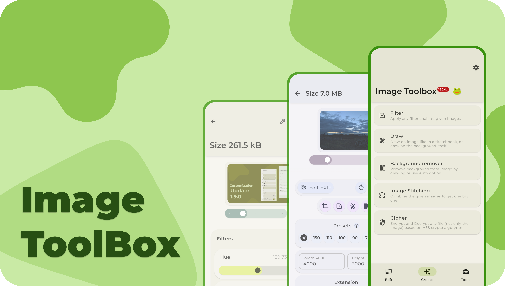
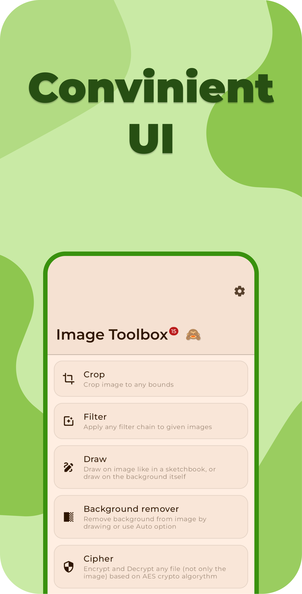
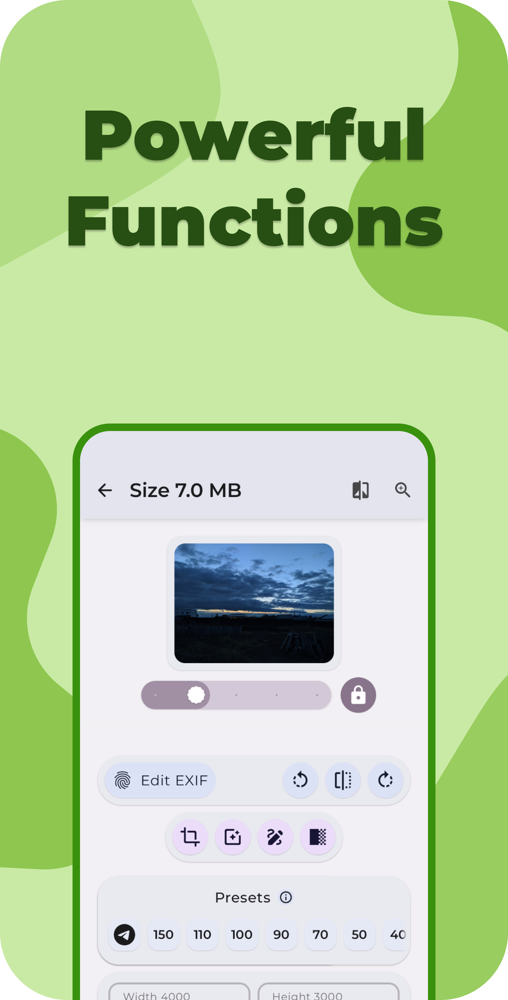
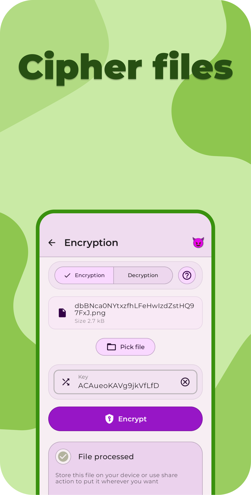
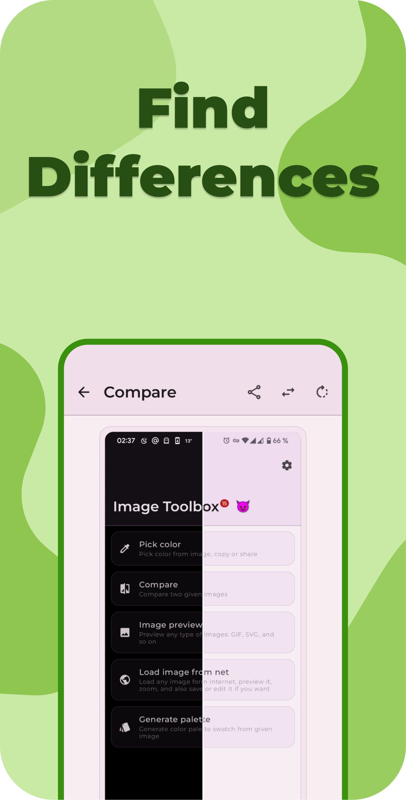
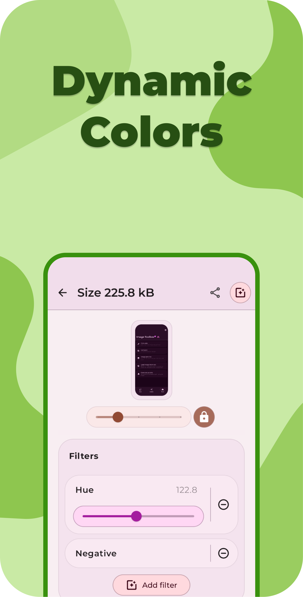
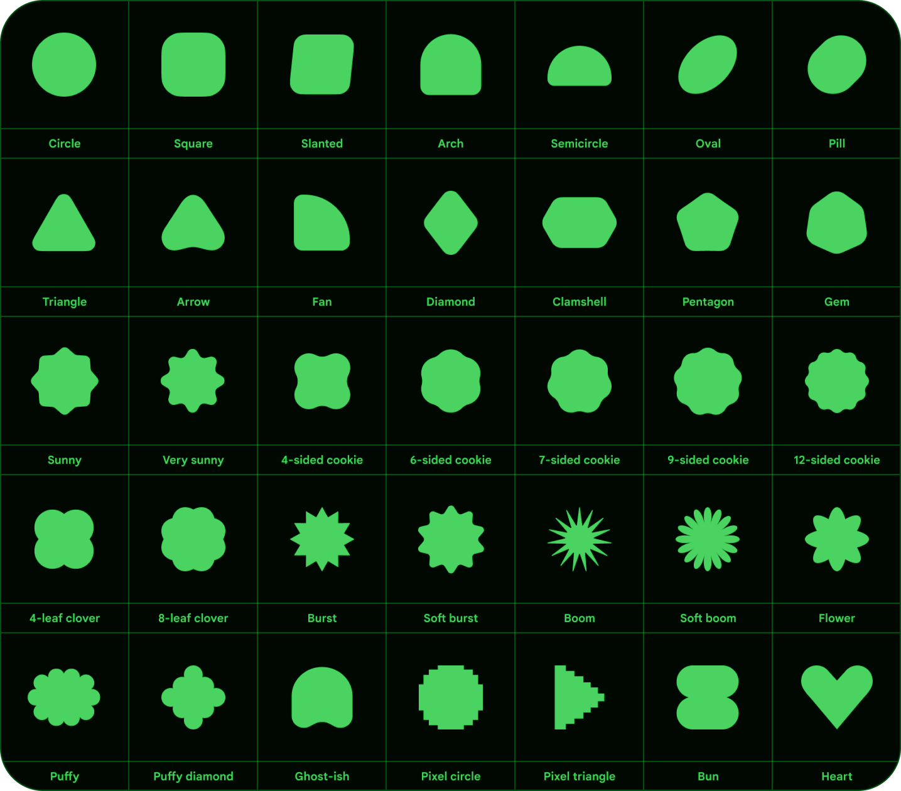
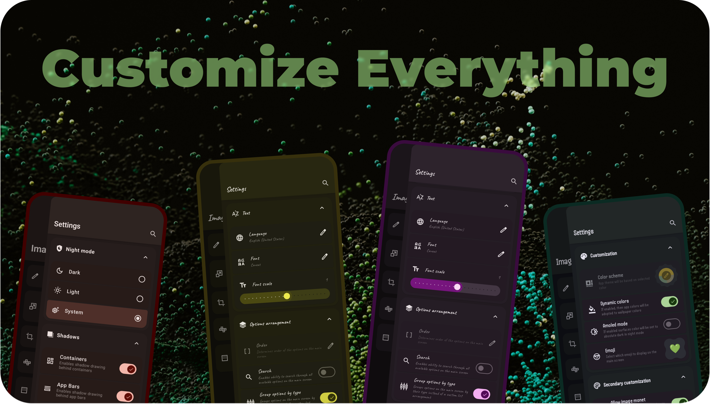
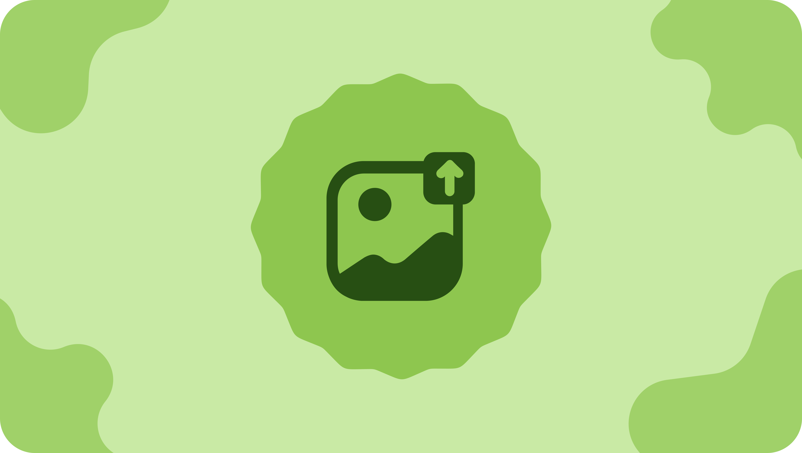

<div align="center">
</br>


</div>

<div align="center">

# Image Toolbox

</div>

</br>

<p align="center">
  </a>
  </a>
  </a> 
    </a>
  </br>
  </br>
 <a href=""></a>
  <a href="https://github.com/T8RIN/ImageToolbox/actions">
  
  
  
  </br>
  </br>
  <a href="https://hits.sh/github.com/t8rin/ImageResizer/">
      </a>
  <a href="https://github.com/t8rin/ImageResizer/releases">
      
  </a>
  <a href="https://github.com/t8rin/ImageResizer/stargazers">
      
  </a>
  </br>
  <a href="https://github.com/t8rin/imageresizer/releases/latest">
      
  </a>
   <a href="https://play.google.com/store/apps/details?id=ru.tech.imageresizershrinker">
      
  </a>
  <a href="https://f-droid.org/packages/ru.tech.imageresizershrinker">
      
  </a>
</br>
    </br>
   <a href="https://hellogithub.com/repository/4c5f2fae4eb545ab87cad9ffd19870ca" target="_blank"></a>

</p>

<div align="center">

# 🗺️ Project Overview

ImageToolbox is a versatile image editing tool designed for efficient photo manipulation. It allows
users to crop, apply filters, edit EXIF data, erase backgrounds, and even convert images to PDFs.
Ideal for both photographers and developers, the tool offers a simple interface with powerful
capabilities.

</div>

<p align="middle">
    
    
    
    
    
    
    
    
</p>

<div align="center">

# 📔 Wiki
Check out Image Toolbox [Wiki](https://github.com/T8RIN/ImageToolbox/wiki) for FAQ and useful info
</br>
</br>

# ✈️ Telegram Links

</br>
<a href="https://t.me/t8rin_imagetoolbox">
    
  </a>

  <a href="https://t.me/t8rin_imagetoolbox_ci">
    
  </a>

  </br>
  </br>
  Join our chat where you can discuss anything you want and also look into the CI channel where I post betas and announcements
  </br>

# ☕ Buy me a coffee

This application is completely free, but if you want to support the project development, you can
send a donation to the crypto wallets below

| </br>  <br/> <br/> -> `17Pk1RurnkJxLV9V7mc6Y7dLyHFb9rvQDq` <- <br/> <br/> | </br>  <br/> <br/> -> `TMPAu7a54NvQNEKnNWh3naXu3oYijqP3U7` <- <br/> <br/> |
|:--------------------------------------------------------------------------------------------------------------------------------------------------------------------------------------:|:----------------------------------------------------------------------------------------------------------------------------------------------------------------------------:|

# 📲 Download

Go to the [Releases](https://github.com/t8rin/imageresizer/releases/latest) and the download latest
apk
or click one of the badges below.

</br>

<p align="middle">
    <a href="https://play.google.com/store/apps/details?id=ru.tech.imageresizershrinker"></a>
    <a href="https://f-droid.org/packages/ru.tech.imageresizershrinker"></a>
    <a href="https://github.com/t8rin/imageresizer/releases/latest"></a>
</p>
</div>

# 💻 Installation Instructions

1. Clone the repository:
   ```bash
   git clone https://github.com/yourusername/ImageToolbox.git
   ```
2. Install dependencies using your preferred package manager (e.g., Gradle).
3. Build the project:
   bash ./gradlew build
4. Run the application:
   bash ./gradlew run

# ⚔️ FOSS vs MARKET

|    **Feature**     |      **FOSS**      |     **Market**     |
|:------------------:|:------------------:|:------------------:|
|     QR Scanner     |       Zxing        |       MlKit        |
|   Auto erase BG    |        :x:         |       MlKit        |
|  Document Scanner  |       OpenCV       |       MlKit        |
|     Analytics      |        :x:         | :white_check_mark: |
|    Crashlytics     |        :x:         | :white_check_mark: |
| Other Google deps  |        :x:         | :white_check_mark: |
| All Other Features | :white_check_mark: | :white_check_mark: |

# ✨ Features

- Batch processing
- Applying filter chains (More than 230 various filters)

  <details>
  <summary>Available filters</summary>
  <br>

    - [x] Saturation
    - [x] Contrast
    - [x] Brightness
    - [x] Exposure
    - [x] RGB
    - [x] Hue
    - [x] White Balance
    - [x] Monochrome
    - [x] Black and White
    - [x] False Color
    - [x] Sharpen
    - [x] Gamma
    - [x] Highlights and Shadows
    - [x] Haze
    - [x] Sepia Tone
    - [x] Color Inversion
    - [x] Solarize
    - [x] Vibrance
    - [x] Luminance Threshold
    - [x] Pixellate
    - [x] Halftone
    - [x] Crosshatch
    - [x] Sobel Edge Detection
    - [x] Sketch Filter
    - [x] Toon Filter
    - [x] SmoothToon Filter
    - [x] CGA Colorspace Filter
    - [x] Posterize
    - [x] Convolution 3x3
    - [x] Emboss Filter
    - [x] Laplacian
    - [x] Kuwahara Filter
    - [x] Vignette
    - [x] Gaussian Blur
    - [x] Box Blur
    - [x] Stack Blur
    - [x] Fast Blur
    - [x] Bilaterial Blur
    - [x] Zoom Blur
    - [x] Median Blur
    - [x] Pixelation
    - [x] Enhanced Pixelation
    - [x] Stroke Pixelation
    - [x] Circle Pixelation
    - [x] Enhanced Circle Pixelation
    - [x] Diamond Pixelation
    - [x] Enhanced Diamond Pixelation
    - [x] Swirl Distortion
    - [x] Bulge Distortion
    - [x] Sphere Refraction
    - [x] Glass Sphere Refraction
    - [x] Dilation
    - [x] Non Maximum Suppression
    - [x] Opacity
    - [x] Weak Pixel Inclusion Filter
    - [x] Color Matrix 4x4
    - [x] Lookup
    - [x] Color Replacement
    - [x] Color Removance
    - [x] Bayer Two Dithering
    - [x] Bayer Three Dithering
    - [x] Bayer Four Dithering
    - [x] Bayer Eight Dithering
    - [x] Floyd Steinberg Dithering
    - [x] Jarvis Judice Ninke Dithering
    - [x] Sierra Dithering
    - [x] Two Row Sierra Dithering
    - [x] Sierra Lite Dithering
    - [x] Atkinson Dithering
    - [x] Stucki Dithering
    - [x] Burkes Dithering
    - [x] False Floyd Steinberg Dithering
    - [x] Left To Right Dithering
    - [x] Random Dithering
    - [x] Simple Threshold Dithering
    - [x] Quantizier
    - [x] Glitch Effect
    - [x] Enhanced Glitch Effect
    - [x] Anaglyph
    - [x] Noise
    - [x] Tent Blur
    - [x] Side Fade
    - [x] Erode
    - [x] Anisotropic Diffusion
    - [x] Horizontal Wind Stagger
    - [x] Fast Bilaterial Blur
    - [x] Poisson Blur
    - [x] Logarithmic Tone Mapping
    - [x] Aces Filmic Tone Mapping
    - [x] Crystallize
    - [x] Fractal Glass
    - [x] Marble
    - [x] Oil
    - [x] Water Effect
    - [x] Hable Filmic Tone Mapping
    - [x] Aces Hill Tone Mapping
    - [x] Hejl Burgess Tone Mapping
    - [x] Perlin Distortion
    - [x] Grayscale
    - [x] Dehaze
    - [x] Color Matrix 3x3
    - [x] Achromatomaly
    - [x] Achromatopsia
    - [x] Browni
    - [x] CodaChrome
    - [x] Cool
    - [x] Deutaromaly
    - [x] Deutaronotopia
    - [x] Night Vision
    - [x] Polaroid
    - [x] Protanopia
    - [x] Protonomaly
    - [x] Tritanopia
    - [x] Tritonomaly
    - [x] Vintage
    - [x] Warm
    - [x] Grain
    - [x] Unsharp
    - [x] Pastel
    - [x] Orange Haze
    - [x] Pink Dream
    - [x] Golden Hour
    - [x] Hot Summer
    - [x] Purple Mist
    - [x] Sunrise
    - [x] Colorful Swirl
    - [x] Soft Spring Light
    - [x] Autumn Tones
    - [x] Lavender Dream
    - [x] Cyberpunk
    - [x] Lemonade Light
    - [x] Spectral Fire
    - [x] Night Magic
    - [x] Fantasy Landscape
    - [x] Color Explosion
    - [x] Electric Gradient
    - [x] Caramel Darkness
    - [x] Futuristic Gradient
    - [x] Green Sun
    - [x] Rainbow World
    - [x] Deep Purple
    - [x] Space Portal
    - [x] Red Swirl
    - [x] Digital Code
    - [x] Bokeh
    - [x] Neon
    - [x] Old Tv
    - [x] Shuffle Blur
    - [x] Mobius
    - [x] Uchimura
    - [x] Aldridge
    - [x] Drago
    - [x] Color Anomaly
    - [x] Quantizier
    - [x] Ring Blur
    - [x] Cross Blur
    - [x] Circle Blur
    - [x] Star Blur
    - [x] Motion Blur
    - [x] Fast Gaussian Blur 2D
    - [x] Fast Gaussian Blur 3D
    - [x] Fast Gaussian Blur 4D
    - [x] Equalize Histogram
    - [x] Equalize Histogram HSV
    - [x] Equalize Histogram Pixelation
    - [x] Equalize Histogram Adaptive
    - [x] Equalize Histogram Adaptive LUV
    - [x] Equalize Histogram Adaptive LAB
    - [x] Equalize Histogram Adaptive HSV
    - [x] Equalize Histogram Adaptive HSL
    - [x] Clahe
    - [x] Clahe LUV
    - [x] Clahe LAB
    - [x] Clahe HSL
    - [x] Clahe HSV
    - [x] Crop To Content
    - [x] Linear Box Blur
    - [x] Linear Tent Blur
    - [x] Linear Gaussian Box Blur
    - [x] Linear Stack Blur
    - [x] Gaussian Box Blur
    - [x] Linear Fast Gaussian Next
    - [x] LinearFast Gaussian
    - [x] Linear Gaussian
    - [x] Low Poly
    - [x] Sand Painting
    - [x] Palette Transfer
    - [x] Enhanced Oil
    - [x] Simple Old TV
    - [x] HDR
    - [x] Simple Sketch
    - [x] Gotham
    - [x] Color Poster
    - [x] Tri Tone
    - [x] Clahe Oklch
    - [x] Clahe Jzazbz
    - [x] Clahe Oklab
    - [x] Yililoma Dithering
    - [x] Clustered 2x2 Dithering
    - [x] Clustered 4x4 Dithering
    - [x] Clustered8x8 Dithering
    - [x] Polka Dot
    - [x] LUT 512\*512
    - [x] Amatorka
    - [x] Miss Etikate
    - [x] Soft Elegance
    - [x] Soft Elegance Variant
    - [x] Bleach Bypass
    - [x] Candlelight
    - [x] Drop Blues
    - [x] Edgy Amber
    - [x] Fall Colors
    - [x] Film Stock 50
    - [x] Foggy Night
    - [x] Kodak
    - [x] Palette Transfer Variant
    - [x] 3D LUT (.cube / .CUBE)
    - [x] Pop Art
    - [x] Celluloid
    - [x] Coffee
    - [x] Golden Forest
    - [x] Greenish
    - [x] Retro Yellow
    - [x] Auto Crop
    - [x] Opening
    - [x] Closing
    - [x] Morphological Gradient
    - [x] Top Hat
    - [x] Black Hat
    - [x] Enhanced Zoom Blur
    - [x] Simple Sobel
    - [x] Simple Laplacian

  </details>

- Custom Filters Creation by Template filters
    - You can create filter from any filter chain
    - Share created filters by QR code
    - Scan filters from the app to get them on your device
- Files encryption and decryption with 100+ different algorithms available
- Adding Stickers and Text (Markup Layers Mode)
- Extract Text From Images
    - 120+ languages
    - 3 Type of data: Fast, Standard, Best
    - Segmentation Mode Selection
    - Engine Mode Selection
    - Custom Tesseract options entering
    - Multiple languages at the same time
- EXIF metadata editing/deleting
- Loading images from internet
- Image Stitching
- Image Stacking
- Image Splitting
- Background Removal
    - By drawing
    - Automatically
- Watermarking
    - Repeating Text
    - Image
    - Stamp
    - Timestamp
- Drawing on Image/Background
    - Pen
    - Neon
    - Highlighter
    - Privacy Blur
    - Pixelation Paint
    - Text
    - Image Brush
    - Filter Brush
    - Spot Healing
    - Pointing Arrow
    - Line
    - Double Pointing Arrow
    - Line Pointing Arrow
    - Double Line Pointing Arrow
    - Outlined Rect
    - Outlined Oval
    - Outlined Triangle
    - Outlined Polygon
    - Outlined Star
    - Rect
    - Oval
    - Triangle
    - Polygon
    - Star
    - Lasso
    - Line Style
        - Dashed
        - Dot Dashed
        - Zigzag
        - Stamped
- Image Resizing
    - Width changing
    - Height changing
    - Adaptive resize
    - Resize retaining aspect ratio
    - Resize by given limits
    - Center Crop with
        - Background color changing
        - Background blur drawing
    - Different Scaling Algorithms
        - Bilinear
        - Nearest Neighbour
        - Cubic
        - Mitchell-Netravalli
        - Catmull-Rom
        - Hermite
        - B-Spline
        - Hann
        - Bicubic
        - Hamming
        - Hanning
        - Blackman
        - Welch
        - Quadric
        - Gaussian
        - Sphinx
        - Bartlett
        - Robidoux
        - Robidoux Sharp
        - Spline 16
        - Spline 36
        - Spline 64
        - Kaiser
        - Bartlett-Hann
        - Box
        - Bohman
        - Lanczos 2
        - Lanczos 3
        - Lanczos 4
        - Lanczos 2 Jinc
        - Lanczos 3 Jinc
        - Lanczos 4 Jinc
        - Ewa Hanning
        - Ewa Robidoux
        - Ewa Blackman
        - Ewa Quadric
        - Ewa Robidoux Sharp
        - Ewa Lanczos 3 Jinc
        - Ginseng
        - Ginseng EWA
        - Lanczos Sharp EWA
        - Lanczos 4 Sharpest EWA
        - Lanczos Soft EWA
        - Haasn Soft
        - Lagrange 2
        - Lagrange 3
        - Lanczos 6
        - Lanczos 6 Jinc
    - Different Scale Color Spaces
        - Linear
        - sRGB
        - LAB
        - LUV
        - Sigmoidal
        - XYZ
        - F32 Gamma 2.2
        - F32 Gamma 2.8
        - F32 Rec.709
        - F32 sRGB
        - LCH
        - Oklab sRGB
        - Oklab Rec.709
        - Oklab Gamma 2.2
        - Oklab Gamma 2.8
        - Jzazbz sRGB
        - Jzazbz Rec.709
        - Jzazbz Gamma 2.2
        - Jzazbz Gamma 2.8
- GIF conversion
    - GIF to images
    - Images to GIF
    - GIF to WEBP
- WEBP conversion
    - WEBP to images
    - Images to WEBP
- APNG conversion
    - APNG to images
    - Images to APNG
- JXL transcoding
    - JXL to JPEG
    - JPEG to JXL
- Animated JXL conversion
    - Images to JXL
    - JXL to Images
    - APNG to JXL
    - GIF to JXL
- PDF tools
    - PDF to images
    - Images to PDF
    - PDF previewing
- Document Scanning
- Barcodes
    - Scanning
    - Creating
    - Sharing as images
    - 13 formats available
      - QR CODE
      - AZTEC
      - CODABAR
      - CODE 39
      - CODE 93
      - CODE 128
      - DATA MATRIX
      - EAN 8
      - EAN 13
      - ITF
      - PDF 417
      - UPC A
      - UPC E
- Collage Creation
    - From 2 to 10 images
    - More than 180 various collage layouts
- Image Shrinking
    - Quality compressing
    - Preset shrinking
    - Reducing size by given weight (in KB)
- Cropping
    - Regular crop
    - Free rotation crop
    - Free corners crop (can be used as Perspective Correction)
    - Crop by aspect ratio
    - Crop with shape mask
        - Rounded Corners
        - Cut Corners
        - Oval
        - Squircle
        - Octagon
        - Rounded Pentagon
        - Clover
        - Material Star
        - Kotlin Logo
        - Small Material Star
        - Heart
        - Shuriken
        - Explosion
        - Bookmark
        - Pill
        - Burger
        - Shield
        - Droplet
        - Arrow
        - Egg
        - Map
        - Enhanced Heart
        - Star
        - Image Mask
        - <details>
          <summary>Additional Shapes</summary>
          </br>
        
          

          </details>


- Image Cutting (can be used as batch crop)         
- Tracing raster images to SVG
- Format Conversion
    - HEIF
    - HEIC
    - AVIF
    - WEBP
    - JPEG
    - JPG
    - PNG Lossless
    - PNG Lossy
    - MozJpeg
    - Jpegli
    - JXL
    - JP2
    - J2K
    - TIFF
    - TIF
    - QOI
    - ICO
    - SVG, DNG, PSD, GIF to static raster images
    - Telegram sticker PNG format
- Files to Zip
- Comparing images
    - Slide
    - Toggle Tap
    - Transparency
    - Side By Side
    - Pixel By Pixel (7 Methods)
        - SSIM
        - AE
        - MAE
        - NCC
        - PSNR
        - RMSE
- Color Utils
    - Palette generation
        - Material You Scheme
        - Simple Colors
    - Picking color from image
    - Gradient creation (Mesh gradients too)
    - Overlaying image with gradient
    - Mixing
    - Conversion
    - Harmonies
    - Shading
    - Tone Curves applying
- Histograms
    - RGB
    - Brightness
    - Camera Like RGB
- Image source selection
- Additional Features
    - Base64 Decode/Encode
    - Rotating
    - Flipping
    - Perlin Noise Generation
    - Previewing SVG, DNG, PSD, DJVU and almost all types of images
    - Saving to any specific folder
    - Long press on save to choose one time output folder
    - Randomizing output filename
    - Using image cheksum as filename
    - Checksum Tools with ability to calculate and compare hashes
    - 64 different hashing algorithms
    - Embedded media picker

**And More!**

#



# 🌟 UI tweaks

- Selecting Emoji for top app bar
- Ability to use Pixel like switch instead of Material You
- Secure Mode for app
- Maximum brightness for selected screens
- In app language changing
- Enabling or Disabling confetti
- Custom app color scheme
    - Different palette styles
    - Predefined schemes
    - Color inversion
    - Contrast adjusting
- Controlling borders thickness
- Enabling and disabling each existing shadow
- Haptics controls
- Light/Dark mode
- AMOLED mode
- Monet implementation (Dynamic colors) even for Android versions less than 12
  by [Dynamic Theme](https://github.com/T8RIN/DynamicTheme)
- Image based color scheme
- Icons Background shape selection
    - Rounded Corners
    - Cut Corners
    - Oval
    - Squircle
    - Octagon
    - Rounded Pentagon
    - Clover
    - Material Star
    - Small Material Star
    - Heart
    - Enhanced Heart
- Custom fonts
    - Montserrat
    - Comfortaa
    - Caveat
    - Handjet
    - Jura
    - Podkova
    - Tektur
    - YsabeauSC
    - DejaVu
    - BadScript
    - RuslanDisplay
    - Catterdale
    - FRM32
    - Tokeely Brookings
    - Nunito
    - Nothing
    - WOPR Tweaked
    - Alegreya Sans
    - Minecraft Gnu
    - Granite Fixed
    - Nokia Pixel
    - Ztivalia
    - Axotrel
    - Lcd Octagon
    - Lcd Moving
    - Unisource
- Ability to import any font (OTF/TTF) to further use
- In app font scale changing
- Changing between options list and grouped view
- Confetti Type selection
    - Default
    - Festive
    - Explode
    - Rain
    - Side
    - Corners
    - ImageToolbox
- Switch Type selection:
    - Material You
    - Compose
    - Pixel
    - Fluent
    - Cupertino
- Slider Type Selection:
    - Fancy
    - Material You
    - Material

(Yes, the app supports dynamic coloring based on wallpapers for every android version)

# 📚 Tech stack & Open-source libraries

- Minimum SDK level 21

- [Kotlin](https://kotlinlang.org/) based

- [Image Toolbox Libs](https://github.com/T8RIN/ImageToolboxLibs) - set of essential libraries for
  Image Toolbox.

- [Dynamic Theme](https://github.com/T8RIN/DynamicTheme) - library, which allows you to easily
  implement custom color theming.

- [Modal Sheet](https://github.com/T8RIN/ModalSheet) - modal bottom sheet that follows M3
  guidelines.

- [Coroutines](https://github.com/Kotlin/kotlinx.coroutines) for asynchronous work.

- [Flow](https://kotlin.github.io/kotlinx.coroutines/kotlinx-coroutines-core/kotlinx.coroutines.flow/)
  to emit values from data layer reactively.

- [Accompanist](https://github.com/google/accompanist) to expand jetpack compose opportunities.

- [Decompose](https://github.com/arkivanov/Decompose) - KMP lifecycle-aware business logic
  components (aka BLoCs) with routing (navigation) and pluggable UI

- [Hilt](https://dagger.dev/hilt/) for dependency injection.

- [Coil](https://github.com/coil-kt/coil) for loading images.

- [Konfetti](https://github.com/DanielMartinus/Konfetti) to establish beautiful particle system.

- Jetpack

    - [Compose](https://developer.android.com/jetpack/compose) - Modern Declarative UI style
      framework based on composable functions.

    - [Material You Kit](https://developer.android.com/jetpack/androidx/releases/compose-material3) -
      Material 3 powerful UI components.

    - [Data Store](https://developer.android.com/jetpack/androidx/releases/datastore) - Store data
      asynchronously, consistently, and transactionally.

    - [Lifecycle](https://developer.android.com/jetpack/androidx/releases/lifecycle) - Observe
      Android lifecycles and handle UI states upon the lifecycle changes.

    - [Exif Interface](https://developer.android.com/jetpack/androidx/releases/exifinterface) - Read
      and write image file EXIF tags.

- [GPU Image](https://github.com/cats-oss/android-gpuimage) for creating and applying filters to the
  images.

- [SmartToolFactory](https://github.com/SmartToolFactory) provides a bunch of helpful libraries.

- [AVIF Coder](https://github.com/awxkee/avif-coder)
  and [JXL Coder](https://github.com/awxkee/jxl-coder) libraries which provide avif, heic, heif and
  jxl support.

- [Aire](https://github.com/awxkee/aire) and [Trickle](https://github.com/T8RIN/Trickle) for
  creating and applying filters to the images on CPU
  using native cpp code.

<div align="center">

#



# 🌐 Translation

You can help translate Image Toolbox into your language
on [Hosted Weblate](https://hosted.weblate.org/engage/image-resizer/)

[](https://hosted.weblate.org/engage/image-resizer/)
</br>
[](https://hosted.weblate.org/engage/image-resizer/)

# ❤️ Find this repository useful?

Support it by joining **[stargazers](https://github.com/t8rin/ImageResizer/stargazers)** for this
repository. :star: <br>
And **[follow](https://github.com/t8rin)** me for my next creations! 🤩

# ⭐ Star History

<a href="https://star-history.com/#T8RIN/ImageToolbox&Date">
 <picture>
   <source media="(prefers-color-scheme: dark)" srcset="https://api.star-history.com/svg?repos=T8RIN/ImageToolbox&type=Date&theme=dark" />
   <source media="(prefers-color-scheme: light)" srcset="https://api.star-history.com/svg?repos=T8RIN/ImageToolbox&type=Date" />
   
 </picture>
</a>


# 📢 Contributors

<a href="https://github.com/t8rin/imageresizer/graphs/contributors">
  
</a>

# ⚖️ License

```xml
Designed and developed by 2023 T8RIN

    Licensed under the Apache License, Version 2.0 (the "License");you may not use this file except in compliance with the License.You may obtain a copy of the License at

    http://www.apache.org/licenses/LICENSE-2.0

    Unless required by applicable law or agreed to in writing, softwaredistributed under the License is distributed on an "AS IS" BASIS,WITHOUT WARRANTIES OR CONDITIONS OF ANY KIND, either express or implied.See the License for the specific language governing permissions andlimitations under the License.
```


Photos
by <a href="https://unsplash.com/@pawel_czerwinski?utm_content=creditCopyText&utm_medium=referral&utm_source=unsplash">
Pawel Czerwinski</a>
on <a href="https://unsplash.com/photos/an-abstract-photo-of-a-green-and-black-background-pSNM2lEOnTo?utm_content=creditCopyText&utm_medium=referral&utm_source=unsplash">
Unsplash</a>

</div>
